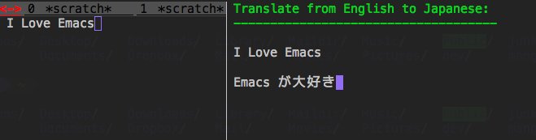

# microsoft-translator.el

## Introduction

The Microsoft Translator services which can be used
in Emacs to perform language translation operations.


## Screenshot




## Registering your application

To register your application with Azure DataMarket, 
visit https://datamarket.azure.com/developer/applications/ using the
LiveID credentials from step 1, and click on "Register".
In the "Register your application" dialog box, you can define your own
Client ID and Name. The redirect URI is not used for the Microsoft
Translator API. However, the redirect URI field is a mandatory field,
and you must provide a URI to obtain the access code. A description is
optional.

Take a note of the client ID and the client secret value.


## Basic Usage

### `microsoft-translator-translate`

Read a string in the minibuffer with completion.

### `microsoft-translator-auto-translate`

Read a string in the minibuffer with from-to is auto.


## Sample Configuration

```lisp
(require 'microsoft-translator)

(setq microsoft-translator-client-id "fujimisakari")
(setq microsoft-translator-client-secret "xxxxxxxxxxxxxxxxxxxxxxxx")
(setq microsoft-translator-use-language-by-auto-translate "Japanese")
```
